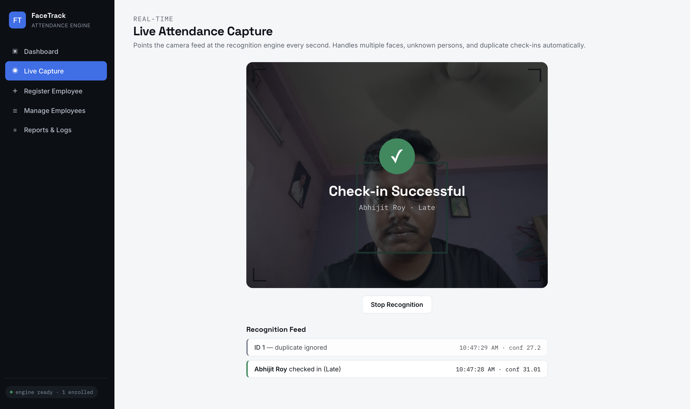
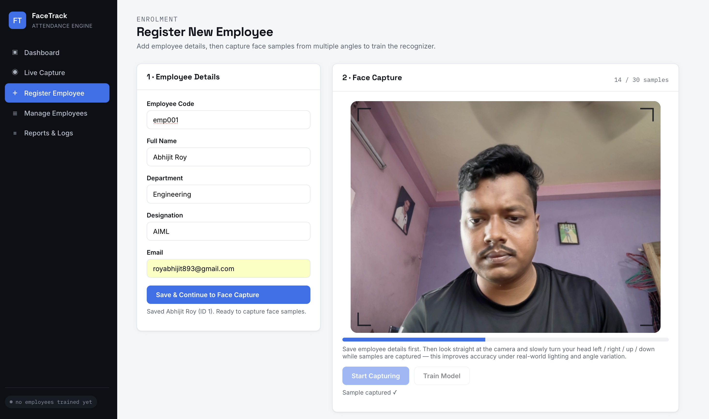
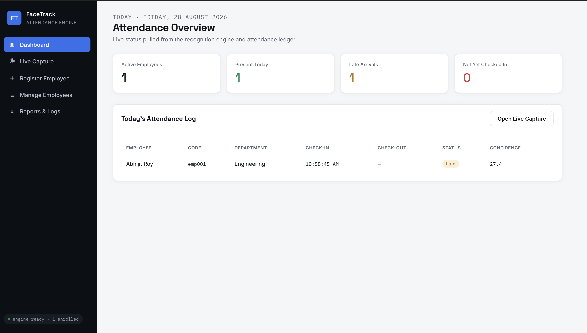
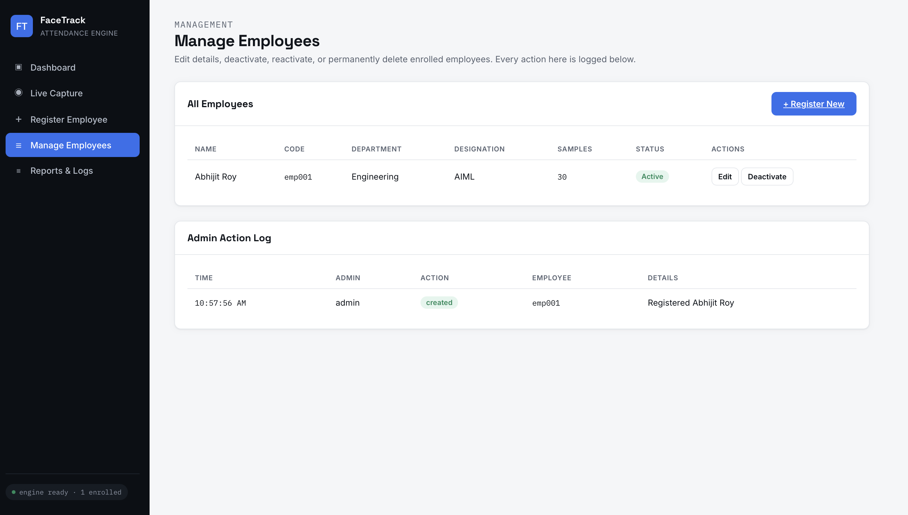

# FaceTrack — AI/ML Employee Attendance Management System

A production-style **Face Recognition Attendance System** built with Python, OpenCV, Flask, and SQLite. Employees are enrolled via webcam, a recognizer is trained on their face samples, and a live camera feed automatically marks attendance — handling multiple faces, unknown persons, duplicate check-ins, and lighting variation.


---

## Table of Contents

- [Screenshots](#screenshots)
- [Project Overview](#1-project-overview)
- [Project Structure](#2-project-structure)
- [Setup](#3-setup)
- [Running Tests](#4-running-tests)
- [Design Decisions & Trade-offs](#5-design-decisions--trade-offs)
- [Security Note](#6-security-note)
- [Tuning for Your Deployment](#7-tuning-for-your-deployment)
- [Roadmap](#8-roadmap)

---

## Screenshots

---

### Live Recognition — real-time check-in with confidence score


---

### Employee Enrollment — guided webcam face capture


---

### Dashboard — today's attendance at a glance


---

### Employee Management — edit, deactivate, reactivate, and a full admin audit trail


---

```
┌─────────────┐      ┌───────────────────┐      ┌──────────────────┐
│   Browser    │◄────►│   Flask REST API   │◄────►│  SQLite Database  │
│ (webcam UI)  │ HTTP │  app/api/routes.py │ ORM  │  employees /       │
└─────────────┘      └─────────┬──────────┘      │  attendance /       │
                                │                  │  recognition_logs   │
                     ┌──────────▼──────────┐      └──────────────────┘
                     │     FaceEngine        │
                     │ Haar detect → CLAHE   │      ┌──────────────────┐
                     │ normalize → LBPH match │◄────►│  Face dataset on   │
                     └──────────┬──────────┘      │  disk (per-employee)│
                                │                  └──────────────────┘
                     ┌──────────▼──────────┐
                     │  AttendanceEngine     │
                     │ check-in/out rules,   │
                     │ duplicate prevention  │
                     └───────────────────────┘
```

## 1. Project Overview

| | |
|---|---|
| **Goal** | Identify registered employees via camera and auto-record attendance |
| **Computer Vision** | OpenCV Haar Cascade (detection) + CLAHE (lighting normalization) |
| **Machine Learning** | OpenCV LBPH (Local Binary Patterns Histogram) face recognizer |
| **Backend** | Python 3, Flask, Flask-SQLAlchemy REST API |
| **Database** | SQLite (swap `SQLALCHEMY_DATABASE_URI` for Postgres/MySQL in production) |
| **Frontend** | Server-rendered HTML + vanilla JS, browser `getUserMedia` webcam capture |

### Real-world cases handled

| Scenario | How it's handled |
|---|---|
| **Multiple faces in frame** | `FaceEngine.detect_faces()` returns *all* faces; each is classified and processed independently in the same `/api/recognize` call. |
| **Unknown / unregistered person** | LBPH returns a distance score; anything above `LBPH_CONFIDENCE_THRESHOLD` is labeled `Unknown`, snapshotted, and logged — attendance is never touched. |
| **Duplicate attendance** | `AttendanceEngine` tracks check-in/check-out state per employee per day; repeat recognitions within a cooldown window are logged as `duplicate_ignored` instead of re-marking attendance. |
| **Varying lighting** | Every frame (enrolment *and* recognition) is grayscaled and passed through CLAHE histogram equalization before detection/matching, so the model isn't thrown off by a brighter or dimmer room. |
| **Late arrival** | Configurable shift start + grace period automatically flags `Late` vs `Present`. |
| **Employee offboarding** | Soft-delete (`is_active=False`) keeps attendance history but removes the person's face data and retrains the model so they're no longer matched; reversible via **Reactivate**. |
| **Mistaken entries / bad data** | Admins can edit or deactivate an employee via the **Manage Employees** page; only an already-deactivated record can be permanently purged, and every action is written to the admin audit log. |

## 2. Project Structure

```
attendance-system/
├── app/
│   ├── __init__.py            # Flask application factory
│   ├── config.py              # All tunable parameters (thresholds, paths, business rules)
│   ├── api/
│   │   ├── routes.py          # REST API endpoints
│   │   └── views.py           # HTML page routes
│   ├── core/
│   │   ├── face_engine.py     # Detection + lighting normalization + LBPH recognition
│   │   ├── dataset_manager.py # On-disk face sample storage
│   │   └── attendance_engine.py # Check-in/out + duplicate + late-arrival business rules
│   ├── models/
│   │   └── db_models.py       # SQLAlchemy models: Employee, Attendance, RecognitionLog, AdminActionLog
│   └── utils/
│       └── image_utils.py     # base64 <-> OpenCV image helpers
├── database/
│   ├── cascades/               # Bundled Haar Cascade XML (face detection model)
│   ├── dataset/                # Per-employee enrolled face images (created at runtime)
│   ├── attendance.db           # SQLite database (created at runtime)
│   ├── lbph_model.yml          # Trained recognizer (created at runtime)
│   └── labels.json             # label <-> employee_id map (created at runtime)
├── static/
│   ├── css/style.css
│   ├── js/common.js
│   └── captures/                # Snapshot log of recognized/unknown events
├── templates/                   # dashboard.html, register.html, live.html, employees.html, reports.html
├── tests/                       # pytest suite (business rules + CV pipeline)
├── docs/
│   ├── ARCHITECTURE.md
│   ├── API.md
│   └── screenshots/             # README images
├── .env.example                 # Template for local environment configuration
├── requirements.txt
└── run.py                       # Entry point
```

## 3. Setup

```bash
git clone https://github.com/YOUR_USERNAME/attendance-system.git
cd attendance-system
python3 -m venv venv
source venv/bin/activate          # Windows: venv\Scripts\activate
pip install -r requirements.txt
cp .env.example .env              # optional — sensible defaults ship without this too
python run.py
```

Configuration is via environment variables, loaded automatically from a local `.env` file if one exists (see `.env.example` for the full list — currently `SECRET_KEY`, `FLASK_DEBUG`, `PORT`). `.env` itself is git-ignored, so no real secrets are ever committed; `.env.example` is the template that ships with the repo.

Open **http://localhost:5001**:

- `/register` — add an employee and capture ~30 face samples via webcam
- `/live` — start real-time recognition; attendance is marked automatically
- `/employees` — edit, deactivate, reactivate, or permanently delete employees; view the admin audit log
- `/` — today's attendance dashboard
- `/reports` — attendance history + full recognition audit log

> **No login is required in this build** — every page and API endpoint is open to anyone who can reach the server. That's fine for a local demo on your own machine, but before exposing this on a shared network or deploying it for real company use, add access control back in (see [Security Note](#6-security-note) below).

> The face-capture pages require browser camera permission and, outside of `localhost`, HTTPS (a browser requirement for `getUserMedia`).

## 4. Running Tests

```bash
pip install pytest
pytest tests/ -v
```

13 tests cover the CV pipeline (detection, training, recognition round-trip) and the attendance business rules (check-in, duplicate suppression, check-out timing, unknown-face handling, inactive employees, late-arrival logic) — all pass against a bundled sample image and an in-memory database, so the suite runs standalone with no camera or external services required.

## 5. Design Decisions & Trade-offs

- **LBPH over deep embeddings (dlib / FaceNet):** LBPH trains and infers on CPU in real time with zero extra native build dependencies — it ships inside `opencv-contrib-python`. This keeps the system deployable on ordinary office hardware without a GPU or a slow `dlib` compile step. The trade-off is lower accuracy on large employee rosters or extreme pose/lighting variation than a modern deep embedding model; `FaceEngine` is written as a swappable component so a deep-learning backend (e.g. ONNX ArcFace) can replace it later without touching the API or business logic.
- **Full retrain on enroll, not incremental learning:** OpenCV's LBPH implementation doesn't reliably support adding one identity without retraining. Retraining on the full dataset takes well under a second for hundreds of employees on typical hardware, so it's simpler and safer than incremental updates.
- **Soft delete for employees:** attendance history is a compliance/payroll record and must survive an employee's face data being removed. Permanent deletion (`/purge`) is only allowed on an already-deactivated record, as a deliberate two-step safeguard against an accidental irreversible action.
- **Admin action audit log:** every create/edit/deactivate/reactivate/purge is recorded (`AdminActionLog`), separate from the face-recognition event log (`RecognitionLog`). This build has no login system, so every action is currently attributed to a generic `"admin"` label rather than a real per-person identity — see [Security Note](#6-security-note) below.
- **SQLite by default:** zero-config for evaluation/demo; swap the `SQLALCHEMY_DATABASE_URI` in `app/config.py` for Postgres/MySQL in production (the ORM layer doesn't change).

## 6. Security Note

**This build has no login system** — `/register`, `/employees`, `/live`, `/reports`, and every API endpoint are open to anyone who can reach the server. That's an intentional simplification for local demos, but it means:

- Anyone on the same network can register, edit, deactivate, or permanently delete employee records
- Anyone can view attendance history and the recognition/admin audit logs

**Before running this anywhere beyond `localhost` on your own machine**, add access control back in:

1. Add a `login_required` / `api_login_required` decorator pair (session cookie check) and apply it to the view routes in `app/api/views.py` and the mutating routes in `app/api/routes.py`
2. Add a `/login` page and route that sets `session["admin_username"]` on success
3. Have `_log_admin_action()` in `app/api/routes.py` read the real logged-in username from the session instead of the current hardcoded `"admin"`

This is a small, self-contained change — the audit log, Manage Employees page, and all business logic already assume an `admin_username` string is available; only the "how do we know who's logged in" piece is missing.

## 7. Tuning for Your Deployment

All of the following live in `app/config.py`:

| Parameter | Effect |
|---|---|
| `LBPH_CONFIDENCE_THRESHOLD` | Lower = stricter matching (fewer false accepts, more false "Unknown"). Tune per camera/lighting. |
| `SAMPLES_PER_EMPLOYEE` | More samples = more robust to pose/lighting, slower enrolment. |
| `DUPLICATE_COOLDOWN_MINUTES` / `MIN_MINUTES_BEFORE_CHECKOUT` | Business rules for how "duplicate" vs. "check-out" is decided. |
| `SHIFT_START_TIME` / `LATE_GRACE_MINUTES` | Late-arrival policy. |
| `DETECT_MIN_SIZE` | Ignore faces smaller than this (reduces false positives from distant background people). |

See [`docs/ARCHITECTURE.md`](docs/ARCHITECTURE.md) for a deeper walkthrough and [`docs/API.md`](docs/API.md) for full endpoint documentation.

## 8. Roadmap

Ideas for extending this project further:

- [ ] Formal accuracy evaluation (false-accept/false-reject rate across a labeled multi-identity test set, with a threshold-tuning curve)
- [ ] Optional deep-embedding backend (ONNX ArcFace / FaceNet) as a swap-in alternative to LBPH, with a side-by-side accuracy comparison
- [ ] Session-based admin login (see [Security Note](#6-security-note))
- [ ] Postgres/MySQL support for multi-instance deployment
- [ ] Docker Compose setup for one-command local spin-up

---

Built as a demonstration of computer vision, applied ML, REST API design, and full-stack integration.
